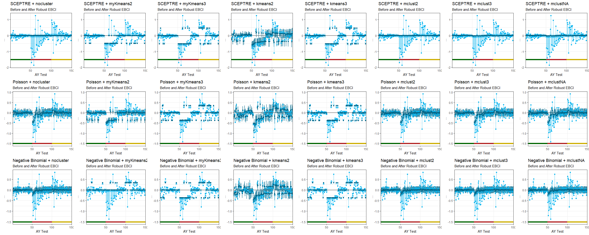
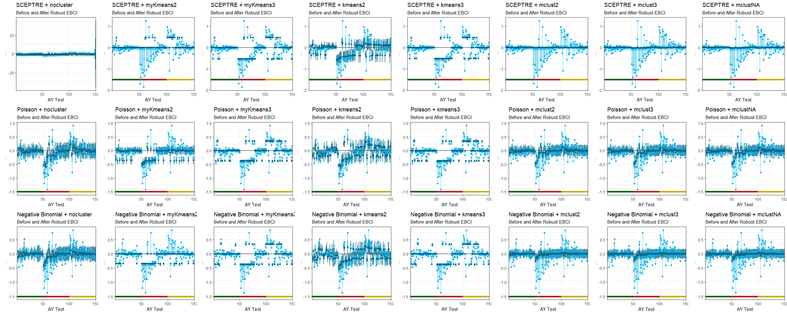
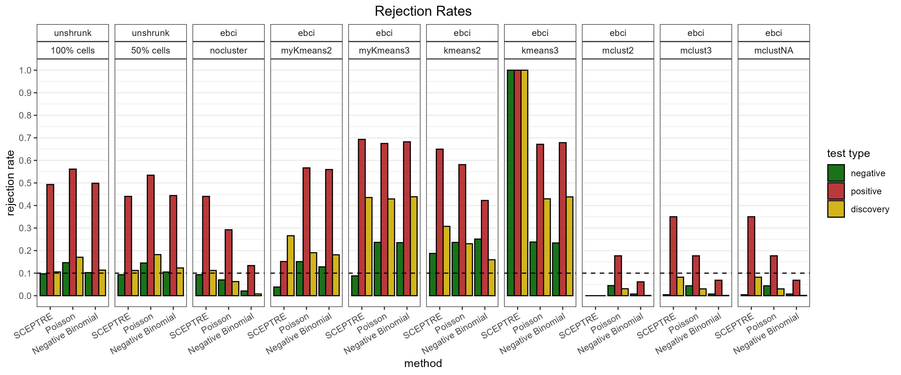

# multilevel-treatment-multivariable-outcome
analysis for scCRISPR screens with multilevel treatments and multivariable outcomes. focusing on shrinkage

# Analysis on scCRISPR screen (Replogle et al., 2020) [^replogle2020]

In this repo, we demonstrate a procedure to analyze data when we are interested in the effects of a multilevel treatment on multivariate outcomes. A multilevel treatment $A$ is a treatment that may take one of many categorical values $A \in \{0, 1, ..., K\}$.
Multivariate outcomes $\textbf{Y} = (Y_1, ..., Y_G)$ are a collection of many outcomes of interest. 

In a binary treatment $A \in \{0, 1\}$ and single outcome $Y$ setting, one may be interested in a potential outcome such as $\mathbb{E}(Y^1)$ and $\mathbb{E}(Y^1)$ 
(a common estimand would be the Average Treatment Effect (ATE) $\mathbb{E}(Y^1) - \mathbb{E}(Y^0)$).
In contrast, a multilevel treatment and multivariable outcome setting may be interested in the the potential outcomes $\mathbb{E}(Y_g^a)$.
Often, a treatment level $A=0$ might be labeled as a 'control' or baseline treatment to which other treatment levels are contrasted. 
Then, one may be interested in the matrix estimand $\Psi \in \mathbb{R}^{K \times G}$ where $\psi_{i,j} = \mathbb{E}(Y_j^i) - \mathbb{E}(Y_j^0).$

While each treatment and outcome pair may be treated as a single test, it may be advantageous to share information across the treatments and outcomes when they might be correlated. 
In this repo, we demonstrate one way to do this by estimating effects individually, finding a low dimensional or sparse structure in the initial estimated effects matrix, and shrinking towards the low dimensional structure. 
Shrinkage allows us to utilize information across treatments and outcomes through the points we shrink towards while also ensuring proper coverage. In particular, we perform shrinkage with the method from Armstrong et al., 2022[^armstrong2022].

## Data

We look at the single cell CRISPR experiment performed by Replogle et. al., 2020 [^replogle2020], where CRISPR perturbations may take effect on individual cells, and then many genes' expression levels are measured using single cell RNA sequencing. 
Each sample is an individual cell.
Each different perturbation is one treatment level.
And each gene is an outcome. 

Letting $A=0$ represent the control treatment (a non-targeting perturbation), we are interested in the effect that a perturbation $a$ may have on a gene $g$'s' level of expression $\mathbb{E}(Y_g^a) - \mathbb{E}(Y_g^0)$.

## Method

The main steps of this analysis is:

1. Estimate effect sizes:
  - split sample (cells) into a 'train' or 'test' dataset
  - SCEPTRE, Barry et al., 2019 [^barry2021] (package: `sceptre`)

2. Approximate matrix: approximate the initial estimated effects training matrix  
  - select subset of perturbations and genes with signal and good quality control
  - we consider a low rank approximation (through singular value decomposition) and a sparse low rank approximation (Witten et al., 2007)[^witten2007] (package: `PMA`)

3. Shrink: shrink the test estimated effects to the approximated matris
  - Armstrong et al., 2022 [^armstrong2022] (package: `ebci`)

## Results

## Discusion

# repo structure

-   `./notebooks/` (code that runs analysis)

    - `./notebooks/replogleEstimate.r` (run SCEPTRE on replogle dataset)

    - `./notebooks/replogleShrinkage.r` (run matrix approximation and shrinkage)

-   util code files (helper util fns)

    -   `./utils/perform_sceptre_cleary.r` (get the original estimates)
    -   `./utils/cluster_and_ebci_shrinkage.r` (perform shrinkage)

-   saves plots in `./plots/`

-   saves objects (rds objects, csv, sceptre object, etc...) in `./saves/`

Each section should save the important objects, and then the following sections can just load the relevant objects. This is done so that each section can be run at different times because each section might take a while to run, and then it is easy to restart at any section.

# References

[^armstrong2022]: Armstrong, Timothy B., Michal Kolesar, and Mikkel Plagborg-Møller (2022). “Robust Empirical Bayes Confidence Intervals”. *Econometrica* 90.6. arXiv:2004.03448 [econ], pp. 2567–2602. issn: 0012-9682. 

[^barry2021]: Barry, Timothy et al. (2021). “SCEPTRE improves calibration and sensitivity in single-cell CRISPR screen analysis”. *Genome Biology* 22.1, p. 344. issn: 1474-760X.

[^replogle2020]: Replogle, Joseph M. et al. (Aug. 2020). “Combinatorial single-cell CRISPR screens by direct guide RNA capture and targeted sequencing”. *Nature Biotechnology* 38.8. Publisher: Nature Publishing Group, pp. 954–961. issn: 1546-1696. 

[^witten2007]: Witten, Daniela M., Robert Tibshirani, and Trevor Hastie (July 2009). “A penalized matrix decomposition, with applications to sparse principal components and canonical correlation analysis”. *Biostatistics (Oxford, England)* 10.3, pp. 15–534. issn: 1468-4357.

<!-- 

 
 
 
 

# old:

# Notebook: `notebooks/shrinkEstimates.qmd` 

Notebook to analyze the cleary dataset with a combination of methods (SCEPTRE, Poisson, Negative Binomial) with clustering (kmeans and mixture modeling) and robust empirical bayes shrinkage.

The structure of the analysis and notebook is:

-   [Perform SCEPTRE w/ cell sample splitting](#sceptre)
-   [Perform GLM (Poisson and Negative Binomial) w/ cell sample splitting](#glm)
-   [Perform robust shrinkage (on estimates or tstat, not decided yet) after clustering (kmeans or mixture models)](#ebci-shrinkage)
-   [Plot Results](#plot-results)

This is a clean version of previous `robustempiricalbayestest.qmd`, which has more unnecessary code which is now stored in utils files. See the utils and/or previous version for more details.

## some details

-   uses the util code files:

    -   `../utils/perform_sceptre_cleary.r` (get the original estimates)
    -   `../utils/cluster_and_ebci_shrinkage.r` (perform shrinkage)

-   saves plots in `../plots/`

-   saves objects (rds objects, csv, sceptre object, etc...) in `../saves/`

-   Each section should save the important objects, and then the following sections can just load the relevant objects. This is done so that each section can be run at different times because each section might take a while to run, and then it is easy to restart at any section.

## SCEPTRE

SCEPTRE (w/ cell sample splitting)

Main created objects to be saved are

-   `../saves/sceptre/sceptre_obj_train.rds`
-   `../saves/sceptre/sceptre_obj_test.rds`
-   `../saves/sceptre/sceptre_obj_all.rds`

## GLM

GLM (w/ sample splitting) on same tests as SCEPTRE

Main created objects to be saved are

-   `../saves/poisson_effects_train.csv`
-   `../saves/poisson_effects_test.csv`
-   `../saves/poisson_effects_all.csv`
-   `../saves/negativebinomial_effects_train.csv`
-   `../saves/negativebinomial_effects_test.csv`
-   `../saves/negativebinomial_effects_all.csv`

## EBCI Shrinkage

EBCI Shrinkage on SCEPTRE + GLM (w/ kmeans and mixture model clustering)

## Plot Results (weight is $1/se^2$)

### Plot Clustering

### Plot Clustering (probabilities)

### Plot Shrinkage

### Plot Rejection Rates

## Plot Results (equal weight)

### Plot Clustering

### Plot Clustering (probabilities)

### Plot Shrinkage

### Plot Rejection Rates

 -->